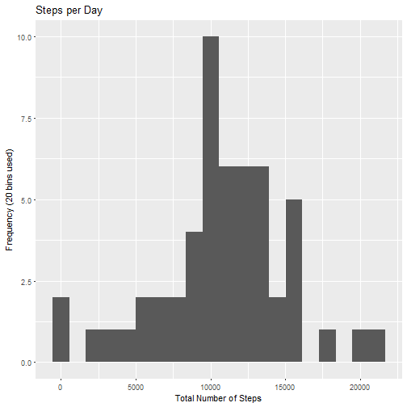

## Peer Assignment Project 1 (week 2)

This document contains a nine-part submission satisfying the requirements of
the project in week 2 of Reproducible Research.

### 1. Code for reading in the dataset and/or processing the data

The following R code reads and processes the given activity.csv file.

```r
activity <- read.csv("activity.csv", na.strings=c("NA")) ## load file
activity$date <- as.Date(as.character(activity$date)) ## transform date
activity_na_rem <- na.omit(activity) # remove NA
```

### 2. Histogram of the total number of steps taken each day

Per instructions, I have ignored the missing values in the dataset to calculate
the total number of steps taken per day and plot the histogram.

First, a call to the plyr, dplyr and ggplot2 packages.

```r
library(plyr)
library(dplyr)
library(ggplot2)
```

Next, a calculation of the aggregate number of steps per day.

```r
steps_per_day <- group_by(activity_na_rem, date) 
steps_per_day <- summarize(steps_per_day, sum(steps)) ## calculates sum of steps per day
```

A histogram of the total number of steps. I've divided the plot into 20 bins.

```r
names(steps_per_day) <- c("date","sum_steps") ## rename columns
p <- ggplot(steps_per_day, aes(x=sum_steps))+geom_histogram(bins=20)
p + labs(title="Steps per Day", x="Total Number of Steps", y="Frequency (20 bins used)")
```



### 3. Mean and median number of steps taken each day

Per instructions, I have ignored the missing values in the dataset to calculate the mean and median of the total number of steps per day.

To display the mean and median, I used the summary() function.

```r
summary(steps_per_day$sum_steps)
```

```
##    Min. 1st Qu.  Median    Mean 3rd Qu.    Max. 
##      41    8841   10765   10766   13294   21194
```
The result as shown above is 10766 for the mean, and 10765 for the median.

### 4. Time series plot of the average number of steps taken

In order to make a time series plot of the 5-minute interval and the average number of steps taken averaged across all days, I first calculated the average number of steps per interval. Again, I've ignored missing values.

```r
avg_per_int <- group_by(activity_na_rem, interval)
avg_per_int <- summarize(avg_per_int, mean(steps))
names(avg_per_int) <- c("interval","mean_steps") ## rename columns
```

Here is the plot of the calculated averages.

```r
plot(avg_per_int$interval, avg_per_int$mean_steps,type="l", main="Average Number of Steps Taken by Interval", xlab="5-minute Interval", ylab="Average Number of Steps Taken")
```


To calculate which 5-minute interval on average across all the days in the dataset contains the maximum number of steps, I used which.max.

```r
avg_per_int[which.max(avg_per_int$mean_steps),]
```

```
## # A tibble: 1 x 2
##   interval mean_steps
##      <int>      <dbl>
## 1      835       206.
```

The interval with the maximum number of steps as shown above is 835.

### 6. Code to describe and show a strategy for imputing missing data

Calculate and report the total number of missing values in the dataset (i.e. the total number of rows with NAs). I used sum() to accomplish this.

```r
sum(is.na(activity$steps))
```

```
## [1] 2304
```

Devise a strategy for filling in all of the missing values in the dataset. The strategy does not need to be sophisticated. For example, you could use the mean/median for that day, or the mean for that 5-minute interval, etc. I used the mean for the corresponding 5-minute interval.

Using the impute() function, the following code replaces missing values with the mean.

```r
imputed_activity <- activity ## preserve activity by creating new df
impute.mean <- function(x) replace(x, is.na(x),mean(x,na.rm=TRUE)) ## create new function to replace NA with given value
imputed_activity <- ddply(imputed_activity, ~ interval, transform, steps=impute.mean(steps)) ## replace NA with mean for the 5-minute interval
```

### 7. Histogram of the total number of steps taken each day after missing values are imputed

The following code produces calculates the total number of steps taken each day with the imputed dataset created above (imputed_activity).

```r
imputed_steps_per_day <- group_by(imputed_activity, date) 
imputed_steps_per_day <- summarize(imputed_steps_per_day, sum(steps)) ## calculates sum of steps per day
```

A histogram of the total number of steps using the imputed dataset. I've divided the plot into 20 bins.

```r
names(imputed_steps_per_day) <- c("date","sum_steps") ## rename columns
p <- ggplot(imputed_steps_per_day, aes(x=sum_steps))+geom_histogram(bins=20)
p + labs(title="Steps per Day", x="Total Number of Steps", y="Frequency (20 bins used)")
```


To display the mean and median total number of steps taken per day using the imputed dataset, I used the following code.

```r
summary(imputed_steps_per_day$sum_steps)
```

```
##    Min. 1st Qu.  Median    Mean 3rd Qu.    Max. 
##      41    9819   10766   10766   12811   21194
```
The result as shown above is 10766 for the mean, and 10766 for the median. Recall that the previously calculated mean was also 10766 and the previously calculated median was 10765. The impact of imputing missing data was that the mean estimate did not change, but the median increased by one step.

### 8. Panel plot comparing the average number of steps taken per 5-minute interval across weekdays and weekends

Using the imputed dataset and the weekday() and case_when() functions, this code adds a new factor variable indicating whether a given date is a weekday or weekend day.

```r
imputed_activity <- mutate(imputed_activity, day_of_week = weekdays(date))

imputed_activity <- mutate(imputed_activity, day_of_week = case_when(day_of_week == "Monday" ~ "Weekday", day_of_week == "Tuesday" ~ "Weekday", day_of_week == "Wednesday" ~ "Weekday", day_of_week == "Thursday" ~ "Weekday", day_of_week == "Friday" ~ "Weekday", day_of_week == "Saturday" ~ "Weekend", day_of_week == "Sunday" ~ "Weekend")) 

imputed_activity$day_of_week <- as.factor(imputed_activity$day_of_week) ## convert character vector to factor
```

Next, to find the average number of steps per interval across all days, I used the aggregate() function.

```r
imp_avg_per_int <- aggregate(steps ~ interval + day_of_week, imputed_activity, mean)
```

The following code produces a panel plot containing a time series plot of the 5-minute interval and the average number of steps taken, averaged across all the weekday days or weekend days.

```r
qplot(data=imp_avg_per_int, interval, steps, geom=c("line"), xlab="Interval", ylab="Number of Steps", main="Average Number of Steps by Interval") + facet_grid(day_of_week ~.)
```


**End of assignment.**
```

